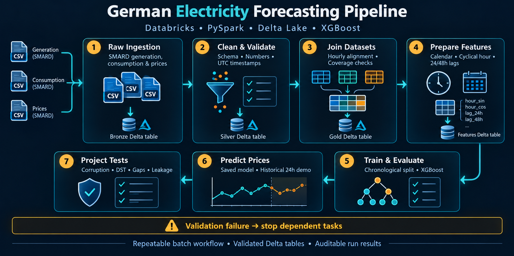
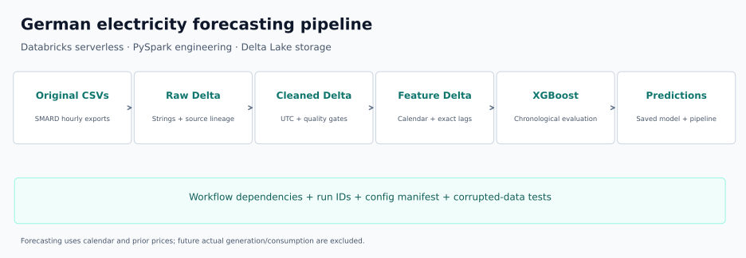
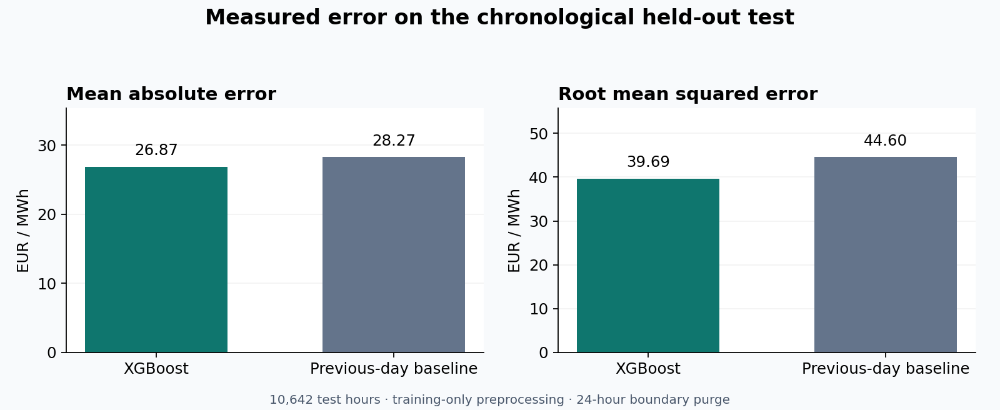

# German Electricity Price Forecasting Pipeline



*Illustrated batch workflow; chart values are illustrative. See the architecture diagram and design documentation for implementation details.*

[](https://github.com/heyiamwahab236/german-electricity-forecasting-pipeline/actions/workflows/tests.yml)

A Databricks and PySpark batch pipeline that turns original SMARD generation, consumption and day-ahead-price CSVs into validated Delta tables, forecasting features and historical XGBoost predictions.

**Verified in Databricks:** 53,256 joined hourly observations, zero unmatched timestamps, zero exact-lag mismatches, and a successful seven-task serverless workflow.

| Held-out test result | MAE (EUR/MWh) | RMSE (EUR/MWh) |
|---|---:|---:|
| XGBoost | **26.87** | **39.69** |
| Previous-day-price baseline | 28.27 | 44.60 |

These are measured historical evaluation results. The separate 24-hour prediction demo is for **28 January 2025**, not a current forecast.



## Documentation

- [Pipeline guide](LEARNING_GUIDE.md) — plain-language explanations of each stage.
- [Verification report](docs/VERIFICATION.md) — actual results and the limits of verification.
- [Recorded run results](reports/verified_run.json) — sanitized Databricks API outputs; metrics are unchanged.
- [Public bundle rerun](reports/portfolio_run.json) — all seven stages reverified in a separate Databricks schema.
- [Tests](tests/) — corrupted data, temporal features and preprocessing leakage checks.



## Workflow

| Stage | Engineering purpose | Notebook |
|---|---|---|
| Raw ingestion | Schema contracts, original strings, source file/record lineage | [02](notebooks/02_Raw_Ingestion.py) |
| Cleaned validation | Strict numbers, DST-aware UTC, explicit null policy, quality gate | [03](notebooks/03_Cleaned_Validation.py) |
| Joins | Full outer join, uniqueness checks and unmatched-source audit | [04](notebooks/04_Join_Validation.py) |
| Features | German calendar, cyclical hour and exact elapsed 24/48-hour price lags | [05](notebooks/05_Feature_Preparation.py) |
| Evaluation | Chronological partitions, boundary purge, training-only preprocessing | [06](notebooks/06_Training_Evaluation.py) |
| Prediction | Reload saved preprocessing/model; generate historical next-24-hour output | [07](notebooks/07_Prediction.py) |
| Tests | Corruption, schema drift, gaps, DST, joins and leakage checks | [08](notebooks/08_Project_Tests.py) |

[Notebook 01](notebooks/01_Setup_Check.py) provides a separate file-access and checksum check. `databricks.yml` connects stages 02–08 and blocks dependent tasks on failure. Run IDs and a configuration manifest prevent stale or mixed-run inputs. There is no recurring schedule.

## Important design decisions

- **Negative prices remain valid.** All 1,489 negative price observations are preserved. Negative residual load is also allowed.
- **Nuclear missingness is explicit.** The 8,724 missing nuclear values remain null, are audited, and are excluded from forecasting predictors.
- **Source order is preserved.** The two autumn 02:00 records are mapped to their distinct UTC instants using source order, then checked for continuous UTC chronology. Unpaired or extra ambiguous records fail.
- **Lags match timestamps, not row positions.** Gaps cannot silently turn a 24-hour lag into a different duration. The first 48 feature rows are excluded from evaluation without future backfill.
- **No future actuals as predictors.** Actual generation and consumption are retained for analytical context but excluded from price-model inputs.
- **Preprocessing fits training only.** Two candidates are selected using validation MAE. A 24-hour purge at each boundary respects the next partition's first forecast origin; the held-out test period is evaluated once.
- **A bounded modeling design.** Spark engineers the data. XGBoost runs on the Python driver with a 200,000-row cap; this is not distributed XGBoost.

Detailed policy and limits are in [DESIGN.md](docs/DESIGN.md).

## Run local tests

Python 3.10–3.12 is supported; CI uses Python 3.11.

```bash
python -m venv .venv
# Linux/macOS: source .venv/bin/activate
# Windows PowerShell: .\.venv\Scripts\Activate.ps1
python -m pip install -e ".[test]"
python -m pytest tests/test_parsing.py tests/test_modeling.py -q
```

For local Spark integration tests, install Java 17 and the extra dependencies:

```bash
python -m pip install -e ".[local,test]"
python -m pytest tests/test_engineering.py -q
```

GitHub Actions verified 18 unit tests and 6 Linux Spark integration tests, plus generated-notebook consistency. Local Windows Spark/Delta end-to-end execution is not claimed; the original full pipeline was verified in Databricks. CI status should be read from the badge/run, not assumed from the presence of a workflow file.

## Deploy to your Databricks workspace

1. Create a catalog/schema and a managed Volume with write access. Databricks Free Edition serverless is supported.
2. Place your original three hourly English-format SMARD CSVs in the Volume's `source/` folder. The required filenames and exact schema are in `config.example.json`.
3. Copy `config.example.json` to **`config.json`**. Set `output_root`, `table_prefix`, and each source `path` to your real Volume/schema locations. `config.json` is ignored by Git.
4. Install the official Databricks CLI and sign in locally:

```bash
databricks auth login --host https://YOUR_WORKSPACE_HOST --profile electricity
```

5. On Windows, import the generated notebooks, upload config/fixtures and deploy the bundle:

```powershell
./scripts/deploy.ps1 -Profile electricity -ConfigPath /Volumes/YOUR_CATALOG/YOUR_SCHEMA/YOUR_VOLUME/config.json
```

The script prints the exact `databricks bundle run` command. `NotebookRoot` can be overridden; otherwise it uses the authenticated user's folder. Supply `-Python` if you need a specific virtual-environment interpreter.

For other platforms, regenerate the notebooks with `python scripts/build_cleaned_notebook.py` and `python scripts/build_workflow.py`, import `notebooks/*.py` into a workspace folder, upload the config and `tests/fixtures/corrupt_price.csv`, then run:

```bash
databricks bundle validate --profile electricity --var 'config_path=/Volumes/YOUR_CATALOG/YOUR_SCHEMA/YOUR_VOLUME/config.json,notebook_root=/Users/YOUR_USER/Electricity Portfolio'
databricks bundle deploy --profile electricity --var 'config_path=/Volumes/YOUR_CATALOG/YOUR_SCHEMA/YOUR_VOLUME/config.json,notebook_root=/Users/YOUR_USER/Electricity Portfolio'
databricks bundle run smard_pipeline --profile electricity --var 'config_path=/Volumes/YOUR_CATALOG/YOUR_SCHEMA/YOUR_VOLUME/config.json,notebook_root=/Users/YOUR_USER/Electricity Portfolio'
```

The cloud test fixture belongs at `<output_root>/project/tests/fixtures/corrupt_price.csv`. Every notebook accepts a `config_path` widget. Shared source functions in `src/` generate the teaching notebooks, so edit the shared functions/builders and regenerate rather than changing generated cells only.

Databricks installs the pinned modeling dependencies through the job environment. It supplies Spark and Delta itself: **do not install PySpark or delta-spark on serverless compute**.

## Provenance and public evidence

This project originated from a [university group electricity-forecasting project](https://gitlab.rz.uni-bamberg.de/mobi/teaching/wise24-projects/dsc-group-5), inspected at revision `8ef4b6a`. The original team notebooks and CSVs are not redistributed here. Credit for that earlier group work remains with the original contributors. The reusable engineering pipeline, test implementation, documentation and technical diagrams are presented in this repository.

SMARD is the source of the electricity data. This repository includes only synthetic corruption fixtures and derived evaluation/prediction results. Original data must be supplied separately under its applicable terms. The MIT license covers this implementation, not third-party source data or the original group project.

The [verification visual](docs/workflow-evidence.png) is rendered from actual recorded Databricks API outputs. It is **not a Databricks console screenshot**. Private workspace URLs, account email and run identifiers are excluded from public evidence. No access to the original workspace is needed to inspect this repository.

